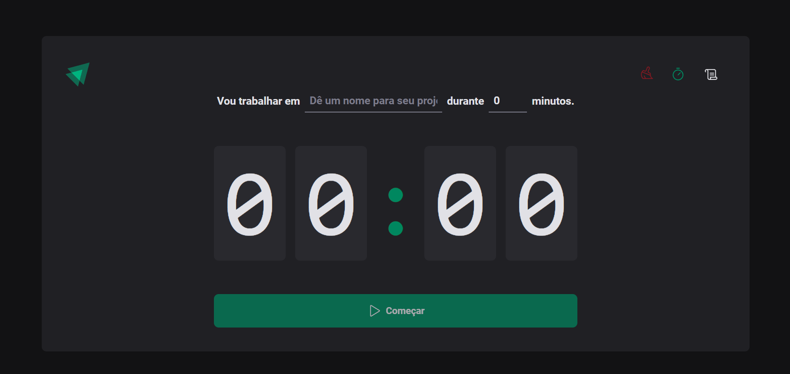

<h1 align="center">Ignite Timer</h1>

<br />

<div align="center">
  
</div>

<br />

## Descrição

Projeto feito em ReactJs.

<div align="center">
  
</div>

<p>-------------</p>

<div align="center">
  
</div>

<p>-------------</p>

<div align="center">
  
</div>

  - Projeto esta com deploy no Netlify [clique aqui](https://ignite-timer-react.netlify.app/)

## 🚀 Instalação

Clone o projeto na sua máquina.

```bash
$ git clone https://github.com/ramomOliveira/ignite-timer.git
$ cd ignite-timer
$ code .
```


Para iniciá-lo, siga as etapas abaixo:

```bash
#instalar as dependências
$ npm install 


#iniciar o projeto
$ npm run dev #para rodar em desenvolvimento
```

</br>

## 🧪 Tecnologias

| Tecnologia            | Versão            |
| --------------------- | ----------------- |
| hookform/resolvers    | `3.3.4 `          |
| Styled-Components     | `6.21.3 `          |
| ReactJs               | `18.2.0 `         |
| react-hook-form       | `7.50.1 `         |
| TypeScript            | `5.2.2 `          |
| zod                   | `3.22.4 `          |
| date-fns              | `3.3.1 `          |
| phosphor-icons        | `2.0.15 `          |

<br />


- Obs: O projeto do curso React da Rocketseat.